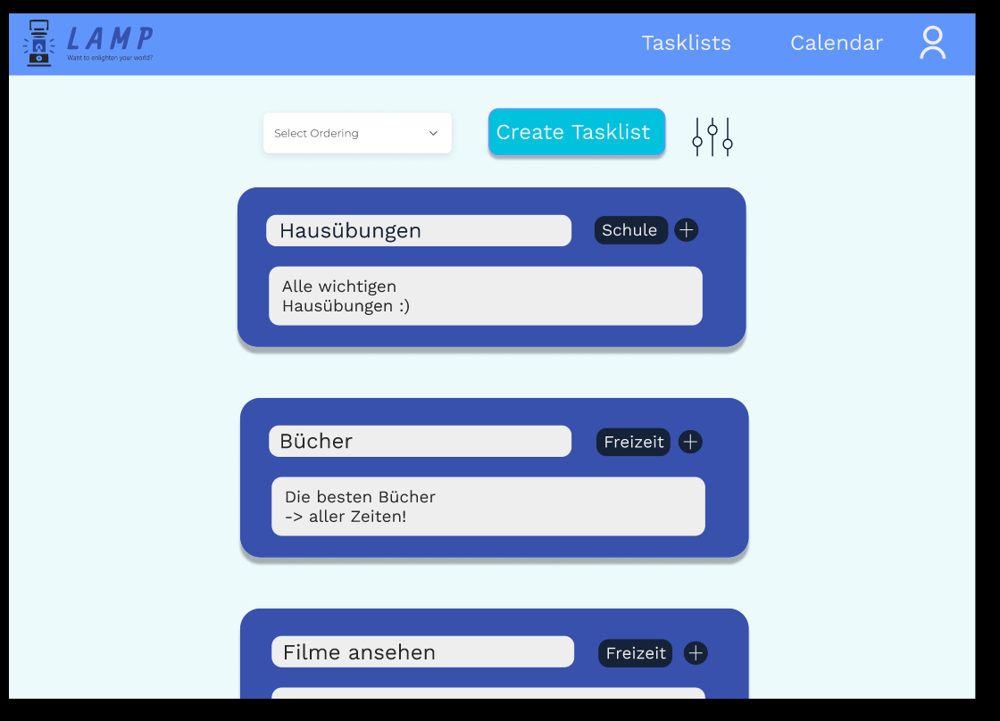

# Project LAMP

## Team-Mitglieder
- <i>L</i> uca Haas
- <i>A</i> ndreas Huber
- <i>M</i> elanie Dohr
- <i>P</i> hilip Raab

## 1. Ausgangslage

### 1.1. Ist-Situation
Über die letzten Jahre haben wir alle verschiedene To-Do Apps ausprobiert. Beispiel sind Notion, Google-Keep und Microsoft To-Do. 
Notion ist für uns zu komplex, da es nicht nur eine To-Do App ist, sondern auch eine App für Notizen und Projekte. Deshalb haben wir meistens nur Microsoft To-Do oder Google Keep benutzt.

Beide Apps verfügen über ein simples Design, welches sowohl in hell und dunkel verfügbar ist. Zudem sind sie sehr einfach zu bedienen, sowohl das Erstellen von neuen Listen, als auch von Tasks, ist intuitiv. Auch Kollaborationen mit anderen Personen sind bei beiden Apps möglich.

Microsoft To-Do überzeugt vor allem, durch das befriedigende Abhacken nach dem Erledigen einer Task und ihre vielen verschiedenen Sortiermöglichkeiten in den Listen.

Google Keep hingegen überzeugt durch die Möglichkeit, Notizen mit Bildern, Zeichnungen und Sprachaufnahmen zu erstellen.

### 1.2. Verbesserungspotenziale
Bei unserer zukünftigen Konkurrenz sind uns einige verbesserungswürdige Merkmale ins Auge gesprungen.  

Bei Beiden stört uns: 
- Es gibt keine Integration eines Kalenders
- Man kann keine einzelnen Notizen mit einem Kennwort schützen
- Man kann keine Prioritäten zu Aufgaben hinzufüge

Bei Google Keep stört uns folgendes:
- Man kann nicht viele Informationen zu einem To-Do hinzufügen, ohne, dass es unübersichtlich wird
- Man kann keine Tasks zwischen verschiedenen Listen verschieben
- Es ist ursprünglich eine Notiz-App deshalb:
  - kann man keine Abgabefrist zu einzelnen To-Dos hinzufügen.
  - gibt es keine verschiedenen Sortiermöglichkeiten der Tasks.
  
Außerdem stört uns an Microsoft To Do:
- Das Design 
- Es gibt keine Events (Siehe Zielsetzung/Kalender)

## 2. Zielsetzung
In unserem Projekt wollen wir eine angenehme Alternative zu anderen To-do Websites schaffen.  
Feature Set:
- Tasks
    - Titel
    - Beschreibung von dem, was zu erledigen ist
    - man kann ein Fälligkeitsdatum hinzufügen (aber nicht notwendig)
    - das Hinzufügen einer Priorität soll möglich sein
- Listen
    - eine Liste umfasst mehrere Tasks (zum Beispiel: eine Liste mit allen Hausaufgaben, und eine Mathe Hausübung ist eine Task davon)
    - Titel
    - das Hinzufügen einer Beschreibung ist möglich
- Tags
    - man kann einer Listen einen Tag anhängen (zum Beispiel eine Liste mit Hausübungen hat den Tag "Schule")
    - Listen können allerdings auch ohne Tag existieren
- Login System
    - von verschiedenen Endgeräten aus auf eigenes Konto zugreifen können
    - es sollen Team-Kollaborationen möglich sein, indem man gemeinsam auf Listen zugreifen kann
- Kalender
    - hinzufügen von Events. Events sind ähnlich wie Tasks nur, dass keine Aufgabe damit verbunden ist (zum Beispiel Schularbeiten, Geburtstage, etc.)
    - Tasks, welche über ein Fälligkeitsdatum verfügen, werden ebenfalls angezeigt
- Sortiermöglichkeiten der Tasks innerhalb der Listen
    - Erstelldatum
    - Priorität
    - zuletzt angesehen
- Farbcodierung der Tasks
    - Rot wenn das Fälligkeitsdatum schon in der Vergangenheit liegt
    - Gelb wenn das Fälligkeitsdatum bald ist
    - Grün wenn eine Task erledigt wurde

## 3. Funktionale Anforderungen

### 3.1. Use Case Überblick
Das Use Case Diagramm beinhaltet alle Use Cases unseres Projekts. Wir haben sie dann folgendermaßen aufgeteilt:

Luca Haas: Kalender ansehen und Event hinzufügen
Andreas Huber: Login und Tag erstellen
Melanie Dohr: Liste erstellen/ändern
Philip Raab: Task erstellen/ändern

### 3.2. Kalender ansehen 

#### 3.2.1. GUI-Design

#### 3.2.2. Workflow

### 3.3. Event hinzufügen

#### 3.3.1. GUI-Design

#### 3.3.2. Workflow

### 3.4. Login

#### 3.4.1. GUI-Design

#### 3.4.2. Workflow

### 3.5. Tag erstellen

#### 3.5.1. GUI-Design

#### 3.5.2. Workflow

### 3.6. Liste erstellen/ändern

#### 3.6.1. GUI-Design

#### 3.6.2. Workflow

### 3.7. Task erstellen/ändern

#### 3.7.1. GUI-Design

#### 3.7.2. Workflow
