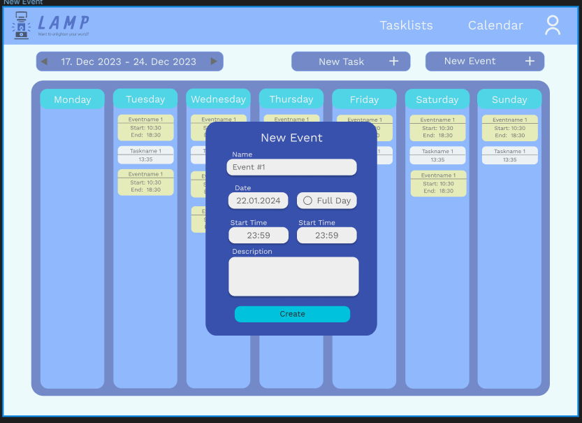
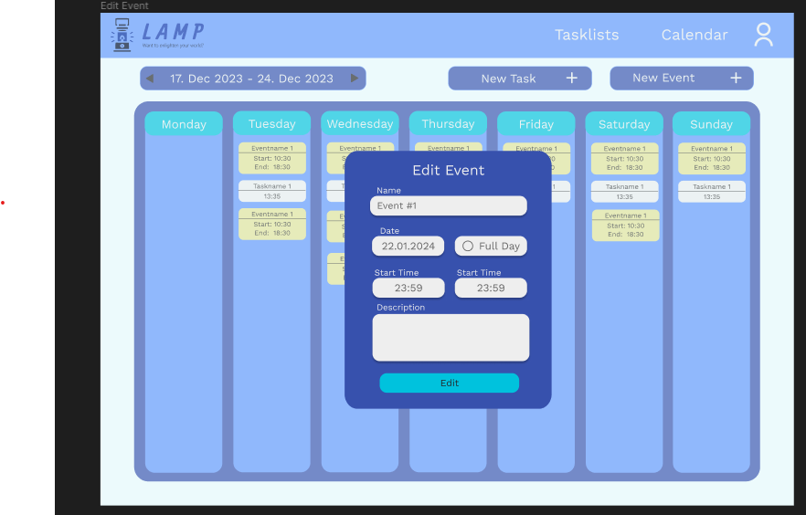
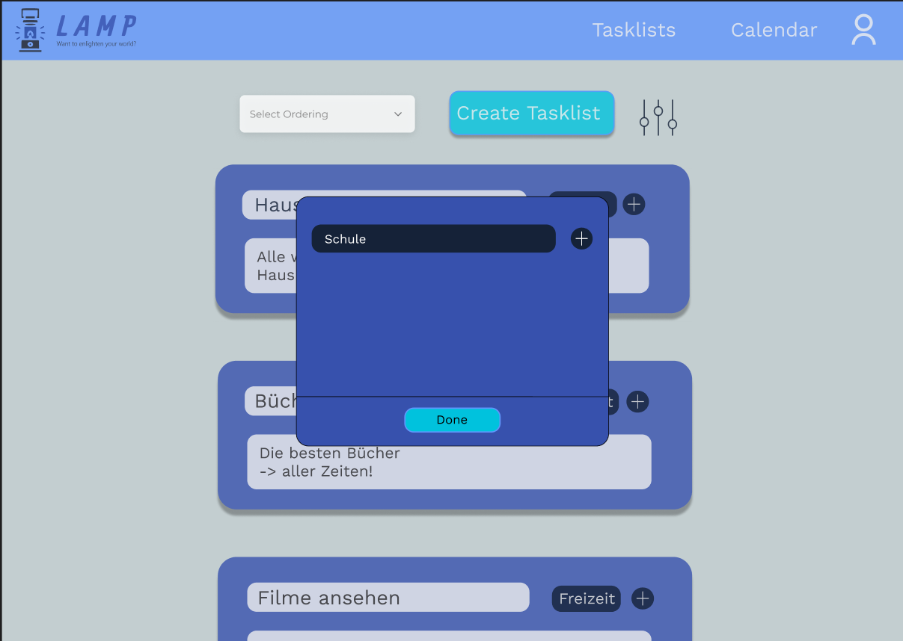

# Project LAMP

## Team-Mitglieder
- <i>L</i> uca Haas
- <i>A</i> ndreas Huber
- <i>M</i> elanie Dohr
- <i>P</i> hilip Raab

## 1. Ausgangslage

### 1.1. Ist-Situation
Über die letzten Jahre haben wir alle verschiedene To-Do Apps ausprobiert. Beispiel sind Notion, Google-Keep und Microsoft To-Do. 
Notion ist für uns zu komplex, da es nicht nur eine To-Do App ist, sondern auch eine App für Notizen und Projekte. Deshalb haben wir meistens nur Microsoft To-Do oder Google Keep benutzt.

Beide Apps verfügen über ein simples Design, welches sowohl in hell und dunkel verfügbar ist. Zudem sind sie sehr einfach zu bedienen, sowohl das Erstellen von neuen Listen, als auch von Tasks, ist intuitiv. Auch Kollaborationen mit anderen Personen sind bei beiden Apps möglich.

Microsoft To-Do überzeugt vor allem, durch das befriedigende Abhacken nach dem Erledigen einer Task und ihre vielen verschiedenen Sortiermöglichkeiten in den Listen.

Google Keep hingegen überzeugt durch die Möglichkeit, Notizen mit Bildern, Zeichnungen und Sprachaufnahmen zu erstellen.

### 1.2. Verbesserungspotenziale
Bei unserer zukünftigen Konkurrenz sind uns einige verbesserungswürdige Merkmale ins Auge gesprungen.  

Bei Beiden stört uns: 
- Es gibt keine Integration eines Kalenders
- Man kann keine einzelnen Notizen mit einem Kennwort schützen
- Man kann keine Prioritäten zu Aufgaben hinzufüge

Bei Google Keep stört uns folgendes:
- Man kann nicht viele Informationen zu einem To-Do hinzufügen, ohne, dass es unübersichtlich wird
- Man kann keine Tasks zwischen verschiedenen Listen verschieben
- Es ist ursprünglich eine Notiz-App deshalb:
  - kann man keine Abgabefrist zu einzelnen To-Dos hinzufügen.
  - gibt es keine verschiedenen Sortiermöglichkeiten der Tasks.
  
Außerdem stört uns an Microsoft To Do:
- Das Design 
- Es gibt keine Events (Siehe Zielsetzung/Kalender)

## 2. Zielsetzung
In unserem Projekt wollen wir eine angenehme Alternative zu anderen To-do Websites schaffen.  
Feature Set:
- Tasks
    - Titel
    - Beschreibung von dem, was zu erledigen ist
    - man kann ein Fälligkeitsdatum hinzufügen (aber nicht notwendig)
    - das Hinzufügen einer Priorität soll möglich sein
- Listen
    - eine Liste umfasst mehrere Tasks (zum Beispiel: eine Liste mit allen Hausaufgaben, und eine Mathe Hausübung ist eine Task davon)
    - Titel
    - das Hinzufügen einer Beschreibung ist möglich
- Tags
    - man kann einer Listen einen Tag anhängen (zum Beispiel eine Liste mit Hausübungen hat den Tag "Schule")
    - Listen können allerdings auch ohne Tag existieren
- Login System
    - von verschiedenen Endgeräten aus auf eigenes Konto zugreifen können
    - es sollen Team-Kollaborationen möglich sein, indem man gemeinsam auf Listen zugreifen kann
- Kalender
    - hinzufügen von Events. Events sind ähnlich wie Tasks nur, dass keine Aufgabe damit verbunden ist (zum Beispiel Schularbeiten, Geburtstage, etc.)
    - Tasks, welche über ein Fälligkeitsdatum verfügen, werden ebenfalls angezeigt
- Sortiermöglichkeiten der Tasks innerhalb der Listen
    - Erstelldatum
    - Priorität
    - zuletzt angesehen
- Farbcodierung der Tasks
    - Rot wenn das Fälligkeitsdatum schon in der Vergangenheit liegt
    - Gelb wenn das Fälligkeitsdatum bald ist
    - Grün wenn eine Task erledigt wurde

## 3. Funktionale Anforderungen

### 3.1. Use Case Überblick
Das Use Case Diagramm beinhaltet alle Use Cases unseres Projekts. Wir haben sie dann folgendermaßen aufgeteilt:

Luca Haas: Kalender und Event 
Andreas Huber: Login und Tags 
Melanie Dohr: Liste an Tasks Ansicht + Erstellung 
Philip Raab: Task Ansicht + Erstellung

### 3.2. Login

#### 3.2.1. GUI-Design

#### 3.2.2. Workflow
Login: 

Man gibt den Benutzernamen und das Passwort in die dafür vorgesehenen Felder auf der Login-Seite ein.
Die Website überprüft, ob die eingegebene Email existiert und ob das Passwort korrekt ist.
Wenn alles stimmt, wird man auf die Main Page weitergeleitet.
Falls die Email noch nicht existiert, hat man sich noch nicht registriert und man kann ganz  auf den Sign Up Button klicken um zur Sign Up Seite weitergeleitet zu werden.

Sign Up:

Der Sign Up funktioniert grundlegend gleich wie der Login, jedoch wird hier auch noch der Name der Person gefordert.
Darauffolgend kann man sich, wenn der Sign Up erfolgreich war, im Login anmelden.

### 3.3. Liste erstellen/ändern

#### 3.3.1. GUI-Design

#### 3.3.2. Workflow
Beim Erstellen einer Tasklist (= Liste an Tasks) muss man einen Titel angeben. Das Hinzufügen einer Beschreibung und Tags, das Auswählen einer Priorität und Sortierordnung und das Einladen von Kollaboratoren ist ebenfalls möglich. Falls man dies allerdings nicht macht, wird eine Standardoption ausgewählt.

Das Hinzufügen von Kollaboratoren funktioniert über einen Einladungslink per E-Mail. Das Auswählen der Priorität funktioniert über ein Dropdown, und die Sorting Order sind klickbare Buttons. Das Hinzufügen von Tags funktioniert über den Namen des Tags, den man entweder bereits zuvor erstellt hat oder dadurch jetzt erstellt.

Beim Ansehen einer Tasklist werden die einzelnen Teile angezeigt. Zudem kann man über ein "+" Tasks hinzufügen. Beim auflisten der Tasks werden jene rot markiert, deren Datum bereits war und jene grau markiert und durchgestrichen, die bereits erledigt wurden. Zudem werden die Tasks gelb markiert, deren Ablaufdatum bald ist. Man kann auch nachträglich Tags hinzufügen, zudem kann man mit dem Drücken eines Papierkorb-Buttons die gesamte Tasklist löschen, wobei dann ein Pop-Up erscheint, ob man das wirklich löschen will. 

Zu einer genaueren Ansicht kommt man, sobald man auf eine Task drückt.

### 3.4. Task erstellen/ändern

#### 3.4.1. GUI-Design

#### 3.4.2. Workflow

### 3.5. Kalender ansehen 

#### 3.5.1. GUI-Design

#### 3.5.2. Workflow
Die Ansicht des Kalenders ist einfach gestalltet.
Er wird in einer Wochenansicht angezeigt. 
In jedem, als Spalte gestaltetem, Tag werden Events in rot und Tasks in weiß angezeigt. 
Auf ersten Blick ist dabei erkennlich wie sie heißen, wann sie starten, bzw bei Events auch wann sie enden.
Beim Klick auf ein Event kommt man zum Menü "Edit Event". 
Mit dem Klick auf eine eingetragene Task wird man auf das Taskfenster(3.4) verwiesen. 
Neben dem Zeitrahmen der heutigen Woche(links oben) befinden sich Pfeile um durch die Wochen zu navigieren.
Außerdem gibt es die Buttons: New Task, New Event
Diese weisen einen auf ein Erstellungsfenster der jeweiligen Kategorie weiter.

### 3.6. Event hinzufügen

#### 3.6.1. GUI-Design

#### 3.6.2. Workflow
Beim Erstellen eines Events gibt es folgende Auswahlmöglichkeiten:
- Name: Der Name des Events, welcher auch in der Kalenderansicht angezeigt wird
- Datum des Events: Tag an dem sich das Event abhält
- Full day: Sollte Full day aktiviert sein, ist es nicht möglich Start und End zu verändern und das Event findet von 0:00 bis 23:59 statt
- Description: Eine Beschreibung des Events
Mit "Create" wird das Event sofort in den Kalender integriert.

### 3.7. Event bearbeiten

#### 3.7.1. GUI-Design

#### 3.7.2. Workflow
Beim Bearbeiten eines Events gibt es folgende Auswahlmöglichkeiten:
- Name: Der Name des Events, welcher auch in der Kalenderansicht angezeigt wird
- Datum des Events: Tag an dem sich das Event abhält
- Full day: Sollte Full day aktiviert sein, ist es nicht möglich Start und End zu verändern und das Event findet von 0:00 bis 23:59 statt
- Description: Eine Beschreibung des Events
Mit "Save" werden zu ändernde Daten sofort richig in der Kalendaransicht angezeigt.
Mit dem Mistkübel kann das Event gelöscht werden und wird somit nicht mehr angezeigt.

### 3.8. Tag erstellen

#### 3.8.1. GUI-Design

#### 3.8.2. Workflow

Das Erstellen eines Tags ist sehr simpel. Man gibt den Namen des zu erstellenden Tags ein und klickt auf das "+" um den Tag zu kreieren.
Mit dem Stift kann man den Namen eines Tags je nach Belieben umbenennen und mit dem Papierkorb kann man einen Tag simpel wieder löschen.
