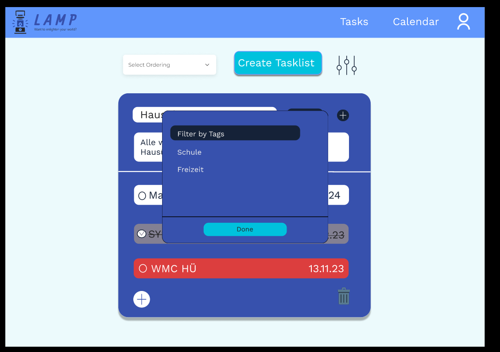
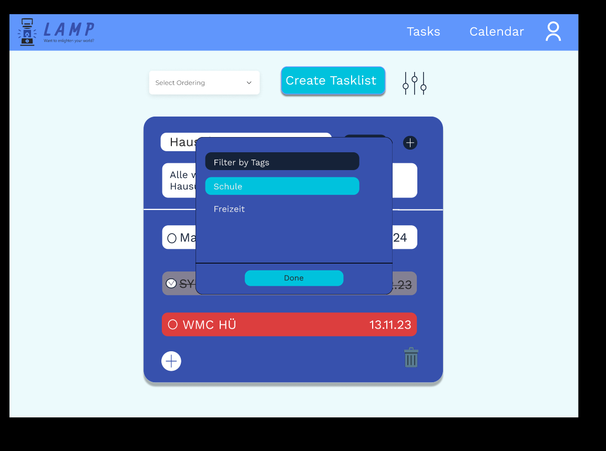
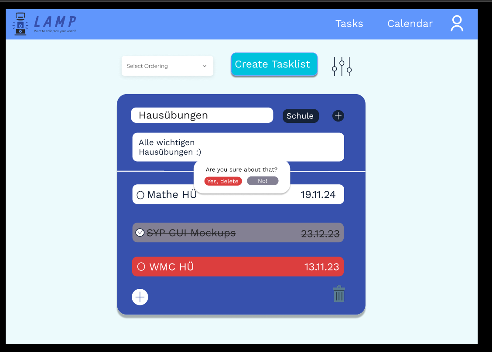
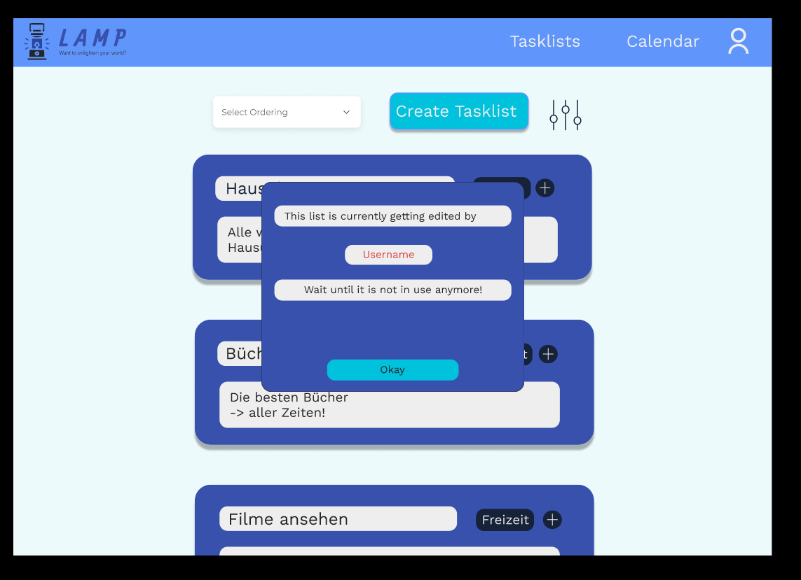
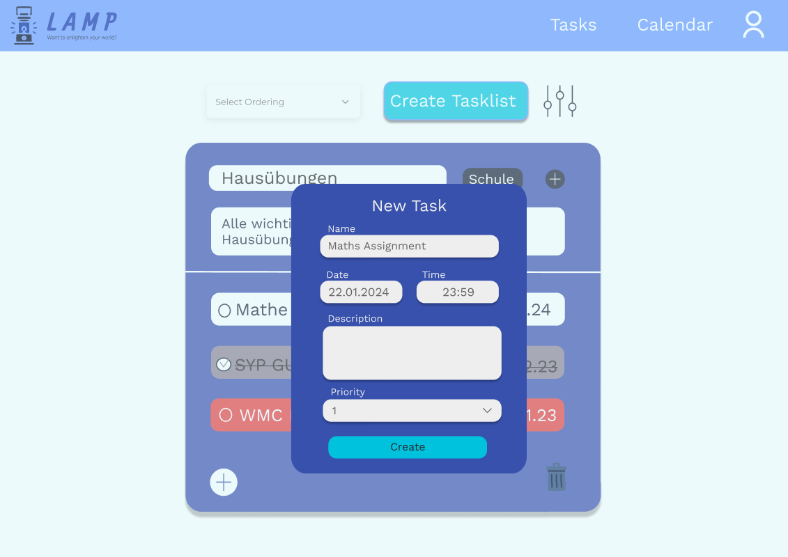
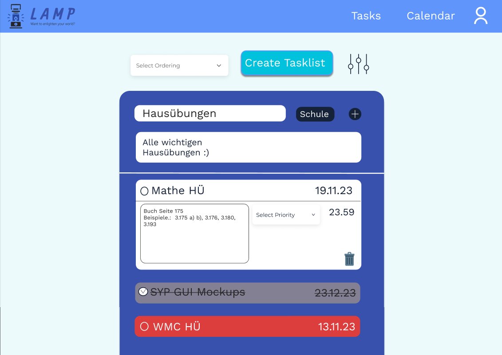
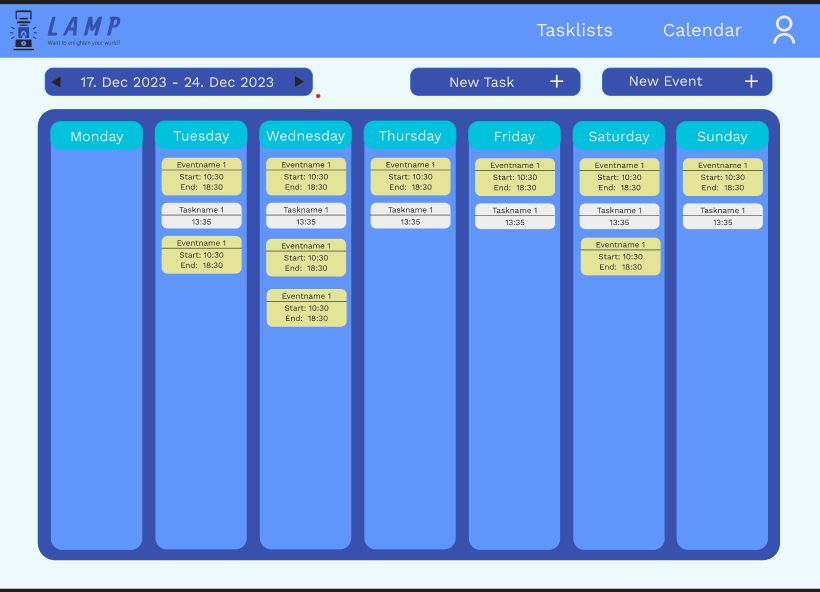

# Project LAMP

## Team-Mitglieder
- <i>L</i> uca Haas
- <i>A</i> ndreas Huber
- <i>M</i> elanie Dohr
- <i>P</i> hilip Raab

# Inhaltsverzeichnis
1. [Ausgangslage](#1-ausgangslage)
    1. [Ist-Situation](#11-ist-situation)
    2. [Verbesserungspotentiale](#12-verbesserungspotenziale)
2. [Zielsetzung](#2-zielsetzung)
3. [Funktionale Anforderungen](#3-funktionale-anforderungen)
    1. [Use Case Diagramm](#31-use-case-überblick)
    2. [Login and Sign Up System](#32-login-and-sign-up-system)
        1. [Login](#321-login)
        2. [Sign Up](#322-sign-up)
    4. [Tasklist](#33-tasklists)
        1. [Alle Tasklists ansehen](#331-alle-tasklists-ansehen)
            1. [GUI-Design](#3311-gui-design)
            2. [Workflow](#3312-workflow)
        2. [Nach Tag filtern](#332-nach-tag-filtern)
            1. [GUI-Design](#3321-gui-design)
            2. [Workflow](#3322-workflow)
        3. [Tasklist erstellen](#333-tasklist-erstellen)
            1. [GUI-Design](#3331-gui-design)
            2. [Workflow](#3332-workflow)
        4. [Tasklist - erweiterte Ansicht](#334-tasklist---erweiterte-ansicht)
            1. [GUI-Design](#3341-gui-design)
            2. [Workflow](#3342-workflow)
        5. [Löschen einer Tasklist](#335-löschen-einer-tasklist)
            1. [GUI-Design](#3351-gui-design)
            2. [Workflow](#3352-workflow)
        6. [Tasklist Error](#336-versuchen-tasklist-anzusehen-während-jemand-anderes-sie-bearbeitet)
            1. [GUI-Design](#3361-gui-design)
            2. [Workflow](#3362-workflow)
            3. [ACD](#3363-acd)
    5. [Task](#34-task)
        1. [Task erstellen](#341-task-erstellen)
            1. [GUI-Design](#3411-gui-design)
            2. [Workflow](#3412-workflow)
        2. [Task ändern](#342-task-ändern)
            1. [GUI-Design](#3421-gui-design)
            2. [Workflow](#3422-workflow)
    6. [Kalender](#35-kalender-ansehen)
        1. [GUI-Design](#351-gui-design)
        2. [Workflow](#352-workflow)
    7. [Event](#36-event-hinzufügen)
        1. [Event hinzufügen](#361-event-hinzufügen)
            1. [GUI-Design](#3611-gui-design)
            2. [Workflow](#3612-workflow)
        2. [Event ändern](#362-event-bearbeiten)
            1. [GUI-Design](#3621-gui-design)
            2. [Workflow](#3622-workflow)
    8. [Tag](#37-tags)
        1. [Tags erstellen](#371-tags-erstellen)
            1. [GUI-Design](#3711-gui-design)
            2. [Workflow](#3712-workflow)
        2. [Tag erstellt](#372-tag-erstellt)
            1. [GUI-Design](#3721-gui-design)
            2. [Workflow](#3722-workflow)
        3. [Tag löschen](#373-tag-löschen)
            1. [GUI-Design](#3731-gui-design)
            2. [Workflow](#3732-workflow)
4. [Nicht funktionale Anforderungen](#4-nicht-funktionale-anforderungen)

## 1. Ausgangslage

### 1.1. Ist-Situation
Über die letzten Jahre haben wir alle verschiedene To-Do Apps ausprobiert. Beispiel sind Notion, Google-Keep und Microsoft To-Do. 
Notion ist für uns zu komplex, da es nicht nur eine To-Do App ist, sondern auch eine App für Notizen und Projekte. Deshalb haben wir meistens nur Microsoft To-Do oder Google Keep benutzt.

Beide Apps verfügen über ein simples Design, welches sowohl in hell und dunkel verfügbar ist. Zudem sind sie sehr einfach zu bedienen, sowohl das Erstellen von neuen Listen, als auch von Tasks, ist intuitiv. Auch Kollaborationen mit anderen Personen sind bei beiden Apps möglich.

Microsoft To-Do überzeugt vor allem, durch das befriedigende Abhacken nach dem Erledigen einer Task und ihre vielen verschiedenen Sortiermöglichkeiten in den Listen.

Google Keep hingegen überzeugt durch die Möglichkeit, Notizen mit Bildern, Zeichnungen und Sprachaufnahmen zu erstellen.

### 1.2. Verbesserungspotenziale
Bei unserer zukünftigen Konkurrenz sind uns einige verbesserungswürdige Merkmale ins Auge gesprungen.  

Bei Beiden stört uns: 
- Es gibt keine Integration eines Kalenders
- Man kann keine einzelnen Notizen mit einem Kennwort schützen
- Man kann keine Prioritäten zu Aufgaben hinzufüge

Bei Google Keep stört uns folgendes:
- Man kann nicht viele Informationen zu einem To-Do hinzufügen, ohne, dass es unübersichtlich wird
- Man kann keine Tasks zwischen verschiedenen Listen verschieben
- Es ist ursprünglich eine Notiz-App deshalb:
  - kann man keine Abgabefrist zu einzelnen To-Dos hinzufügen.
  - gibt es keine verschiedenen Sortiermöglichkeiten der Tasks.
  
Außerdem stört uns an Microsoft To Do:
- Das Design 
- Es gibt keine Events (Siehe Zielsetzung/Kalender)

## 2. Zielsetzung
In unserem Projekt wollen wir eine angenehme Alternative zu anderen To-do Websites schaffen.  
Feature Set:
- Tasks
    - Titel
    - Beschreibung von dem, was zu erledigen ist
    - man kann ein Fälligkeitsdatum hinzufügen (aber nicht notwendig)
    - das Hinzufügen einer Priorität soll möglich sein
- Listen
    - eine Liste umfasst mehrere Tasks (zum Beispiel: eine Liste mit allen Hausaufgaben, und eine Mathe Hausübung ist eine Task davon)
    - Titel
    - das Hinzufügen einer Beschreibung ist möglich
- Tags
    - man kann einer Listen einen Tag anhängen (zum Beispiel eine Liste mit Hausübungen hat den Tag "Schule")
    - Listen können allerdings auch ohne Tag existieren
- Login System
    - von verschiedenen Endgeräten aus auf eigenes Konto zugreifen können
    - es sollen Team-Kollaborationen möglich sein, indem man gemeinsam auf Listen zugreifen kann
- Kalender
    - hinzufügen von Events. Events sind ähnlich wie Tasks nur, dass keine Aufgabe damit verbunden ist (zum Beispiel Schularbeiten, Geburtstage, etc.)
    - Tasks, welche über ein Fälligkeitsdatum verfügen, werden ebenfalls angezeigt
- Sortiermöglichkeiten der Tasks innerhalb der Listen
    - Erstelldatum
    - Priorität
    - zuletzt angesehen
- Farbcodierung der Tasks
    - Rot wenn das Fälligkeitsdatum schon in der Vergangenheit liegt
    - Gelb wenn das Fälligkeitsdatum bald ist
    - Grün wenn eine Task erledigt wurde

## 3. Funktionale Anforderungen

### 3.1. Use Case Überblick
Das Use Case Diagramm beinhaltet alle Use Cases unseres Projekts. Wir haben sie dann folgendermaßen aufgeteilt:

Luca Haas: Kalender und Event 
Andreas Huber: Login und Tags 
Melanie Dohr: Liste an Tasks Ansicht + Erstellung 
Philip Raab: Task Ansicht + Erstellung

### 3.2 Login and Sign-Up System

#### 3.2.1 Login

##### 3.2.1.1 GUI-Design

##### 3.2.1.2 Workflow

Login: 

Man gibt den Benutzernamen und das Passwort in die dafür vorgesehenen Felder auf der Login-Seite ein.
Die Website überprüft, ob die eingegebene Email existiert und ob das Passwort korrekt ist.
Wenn alles stimmt, wird man auf die Main Page weitergeleitet.
Ansonsten muss man sich registrieren, da man sich noch nicht eingeloggt hat.

#### 3.2.2 Sign Up

##### 3.2.2.1 GUI-Design

#### 3.2.2.2 Workflow

Sign Up:

Der Sign Up funktioniert grundlegend gleich wie der Login, jedoch wird hier auch noch der Name der Person gefordert.
Darauffolgend kann man sich, wenn der Sign Up erfolgreich war, im Login anmelden.

### 3.3. Tasklists

#### 3.3.1. Alle TaskLists ansehen

##### 3.3.1.1. GUI-Design

##### 3.3.1.2. Workflow
Auf der Main Page werden alle Tasklists verkürzt angezeigt. Eine Tasklist ist dabei eine Liste an Tasks. Bei der verkürzten Ansicht kann man den Titel, die Tags und die Beschreibung der Tasklist sehen. Man kann die Tasklists nach Tag filtern und eine Sortiermöglichkeit (Creation Date, Priority, Last View) auswählen.

#### 3.3.2. Nach Tag filtern

##### 3.3.2.1. GUI-Design

##### 3.3.2.2. Workflow
Sobald man auf den Button zum Filtern drückt, erscheint ein Filter Pop-up, wobei man hier dann die Tags auswählen kann, nach denen die Tasklists gefiltert werden sollen. Zum Verständnis: Bei dem zweiten GUI Mockup von oben wurde "Schule" ausgewählt, das heißt, man filtert dann alle Tasklists nach dem Tag "Schule"

#### 3.3.3. Tasklist erstellen

##### 3.3.3.1. GUI-Design

##### 3.3.3.2. Workflow
Beim Erstellen einer Tasklist (= Liste an Tasks) muss man einen Titel angeben. Das Hinzufügen einer Beschreibung und Tags, das Auswählen einer Priorität und Sortierordnung und das Einladen von Kollaboratoren ist ebenfalls möglich. Falls man dies allerdings nicht macht, wird eine Standardoption ausgewählt.

Das Hinzufügen von Kollaboratoren funktioniert über einen Einladungslink per E-Mail. Das Auswählen der Priorität funktioniert über ein Dropdown, und die Sorting Order sind klickbare Buttons. Das Hinzufügen von Tags funktioniert über den Namen des Tags, den man entweder bereits zuvor erstellt hat oder dadurch jetzt erstellt.

#### 3.3.4. Tasklist - erweiterte Ansicht

##### 3.3.4.1. GUI-Design

##### 3.3.4.2. Workflow
Sobald man auf eine Tasklist drückt, kommt man zu einer erweiterten Ansicht. Beim Auflisten der Tasks werden jene rot markiert, deren Fälligkeitsdatum verstrichen ist, während diejenigen grau markiert und durchgestrichen werden, die bereits erledigt wurden. Zudem werden die Tasks gelb markiert, deren Ablaufdatum bald ist. Man kann auch nachträglich Tags hinzufügen. 

#### 3.3.5. Löschen einer Tasklist

##### 3.3.5.1. GUI-Design

##### 3.3.5.2. Workflow
Durch das Drücken eines Papierkorb-Buttons das Löschen der gesamten Tasklist möglich, wobei dann ein Pop-Up erscheint, ob man das wirklich will. 

#### 3.3.6. Versuchen Tasklist anzusehen, während jemand anderes sie bearbeitet

##### 3.3.6.1. GUI-Design

##### 3.3.6.2. Workflow
Wenn man versucht, eine Tasklist zu bearbeiten, während dies schon jemand anderer tut, bekommt man eine Fehlermeldung.

##### 3.3.6.3. ACD

### 3.4. Task

#### 3.4.1. Task erstellen

##### 3.4.1.1. GUI-Design

##### 3.4.1.2. Workflow
Nachdem man auf das "+" zum Hinzufügen einer neuen Task geklickt hat, erscheint ein Fenster. In diesem kann man den Namen, die Beschreibung, das Fälligkeitsdatum mit der zugehörigen Tageszeit und die Priorität eingeben. Zum Abschließen dieses Prozesses muss man nur noch auf "Save" klicken.

#### 3.4.2. Task ändern

##### 3.4.2.1. GUI-Design

##### 3.4.2.2. Workflow
Um eine Task zu ändern, braucht man nur darauf zu klicken. Danach "klappt" sich die Task nach unten auf und man kann die Beschreibung, die Priorität und den Fälligkeitszeitpunkt sehen. Um nun ein Element der Task zu ändern, klickt man einfach darauf. Überall kann man dann einfach den neuen Wert eingeben, außer bei der Priorität ist wie immer ein Dropdownmenü. Zum Speichern muss man einfach irgendwo außerhalb des Task klicken.

### 3.5. Kalender ansehen 

#### 3.5.1. GUI-Design

#### 3.5.2. Workflow
Die Ansicht des Kalenders ist einfach aufgebaut.
Er wird in einer Wochenansicht angezeigt. 
In jedem, als Spalte gestaltetem, Tag werden Events rot und Tasks weiß angezeigt. 
Auf ersten Blick ist dabei erkennlich wie sie heißen, wann sie starten, bzw. bei Events auch wann sie enden.
Beim Klick auf ein Event kommt man zum Menü "Edit Event". 
Mit dem Klick auf eine eingetragene Task wird man auf das Taskfenster (siehe 3.4) verwiesen. 
Neben dem Zeitrahmen der heutigen Woche(links oben) befinden sich Pfeile, um durch die Wochen zu navigieren.
Außerdem gibt es die Buttons: New Task, New Event
Diese weisen einen auf ein Erstellungsfenster der jeweiligen Kategorie weiter.

### 3.6. Event

#### 3.6.1 Event hinzufügen

##### 3.6.1.1. GUI-Design

##### 3.6.1.2. Workflow
Beim Erstellen eines Events gibt es folgende Auswahlmöglichkeiten:
- Name: Der Name des Events, welcher auch in der Kalenderansicht angezeigt wird
- Datum des Events: Tag an dem sich das Event abhält
- Full day: Sollte Full day aktiviert sein, ist es nicht möglich Start und End zu verändern. Das Event findet von 0:00 bis 23:59 Uhr statt
- Description: Eine Beschreibung des Events
Mit "Create" wird das Event sofort in den Kalender integriert.

#### 3.6.2 Event bearbeiten

##### 3.6.2.1. GUI-Design

##### 3.6.2.2. Workflow
Beim Bearbeiten eines Events gibt es folgende Auswahlmöglichkeiten:
- Name: Der Name des Events, welcher auch in der Kalenderansicht angezeigt wird
- Datum des Events: Tag an dem sich das Event abhält
- Full day: Sollte Full day aktiviert sein, ist es nicht möglich Start und End zu verändern und das Event findet von 0:00 bis 23:59 statt
- Description: Eine Beschreibung des Events
Mit "Save" werden zu ändernde Daten sofort richig in der Kalendaransicht angezeigt.
Mit dem Mistkübel kann das Event gelöscht werden und wird somit nicht mehr angezeigt.

### 3.7 Tags

#### 3.7.1. Tags erstellen

##### 3.7.1.1 GUI-Design

##### 3.7.1.2 Workflow
Ausgehend davon, dass die beiden Tags Freizeit und Schule, die bereits genannt wurden noch nicht existieren, können wir uns ganz einfach bspw. den Tag Schule erstellen, indem wir den Namen des Tags eingeben und dann auf das '+' zum hinzufügen klicken.

#### 3.7.2 Tag erstellt

##### 3.7.2.1 GUI-Design

##### 3.7.2.2 Workflow
Wie man nun erkennen kann wurde der Tag Schule wie im Beispiel gezeigt erstellt.
Wenn man den Tag Schule als unnötig empfinde kann man diesen einfach per Klick auf den Abfalleimer löschen.

#### 3.7.3 Tag löschen

##### GUI-Design

##### Workflow
Falls man sich entschieden hat das der Tag unnötig war und man den Abfalleimer geklickt hat wurde der Tag nun erflogreich gelöscht.
#### 3.7.2. Workflow

#### Tags Selektion

## 4. Nicht-funktionale Anforderungen
Nach sorgfältiger Überlegung sind wir zu dem Entschluss gekommen, dass uns keine nicht-funktionalen Anforderungen bekannt sind.
